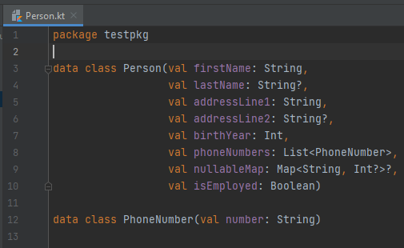
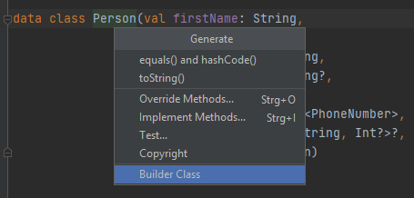
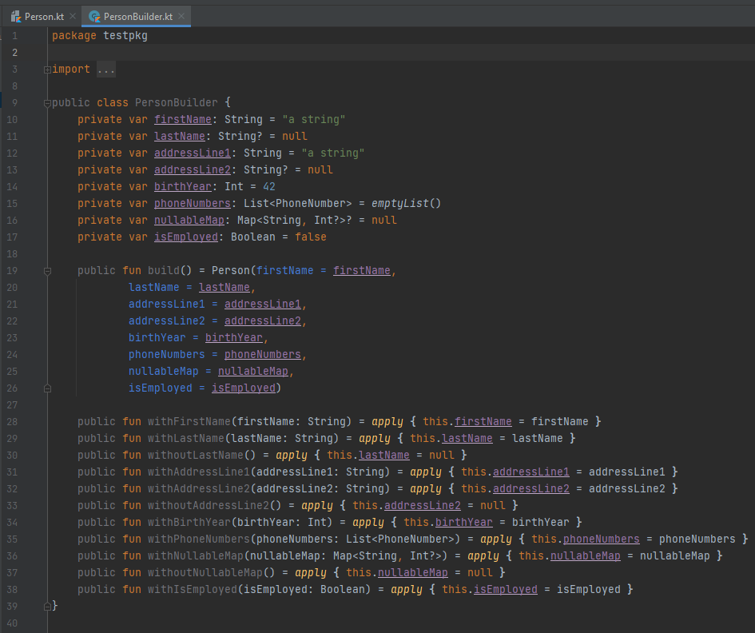

# Kotlin Builder Generator

A plugin for IntelliJ IDEA that auto-generates builder classes for your domain data classes, and saves you a lot of typing.

## General info

This plugin for IntelliJ IDEA provides a quick way to implement a (simplified) Builder pattern for a given Kotlin data class. It will automatically generate a boilerplate builder class with a `build()` method that creates a valid instance of the target data class, and `withX()` methods that allow to manually set all primary constructor properties of the constructed object.

## Features:

- Automatic boilerplate builder class generation
- Pre-set default values for any primitive, nullable and collection properties
- Generated `withoutX()` methods for nullable properties
- Customizable builder class and method names via plugin configuration
- Selectable placement of builder class in production or test sources

### *Work in progress:*

- *Generated methods to add items to collection properties*
- *Automatic wrapping/unwrapping of "wrapped primitive"-type properties*
- *Detection and usage of existing builders for property types*

## Setup

Download the latest `kotlin-builder-generator-plugin-<VERSION>.zip` from the [pipeline artifacts](https://git.maibornwolff.de/intellij-kotlin-builder-plugin/intellij-kotlin-builder-plugin/-/pipelines). 

> Either download all artifacts from the latest pipeline and extract the file from the archive, or click through to the latest `build` job and browse the artifacts there to download only the necessary file. 

Install in your IntelliJ instance via `File -> Settings -> Plugins -> [...] -> Install Plugin from Disk`.

Configure to your liking via `File -> Settings -> Tools -> Kotlin Builder Generator`.

Usage: position cursor on the name of a Kotlin data class, open the `Generate` menu and select `Builder Class`.

## Technologies

- [Kotlin](https://kotlinlang.org/) (written in Kotlin, for Kotlin)
- [IntelliJ Platform SDK](https://plugins.jetbrains.com/docs/intellij/welcome.html) (base SDK for any IntelliJ plugin)
- [KotlinPoet](https://square.github.io/kotlinpoet/) (Kotlin code generation)
- [Gradle](https://gradle.org/) (build tool) 
- [JUnit 4](https://junit.org/junit4/) (tests)